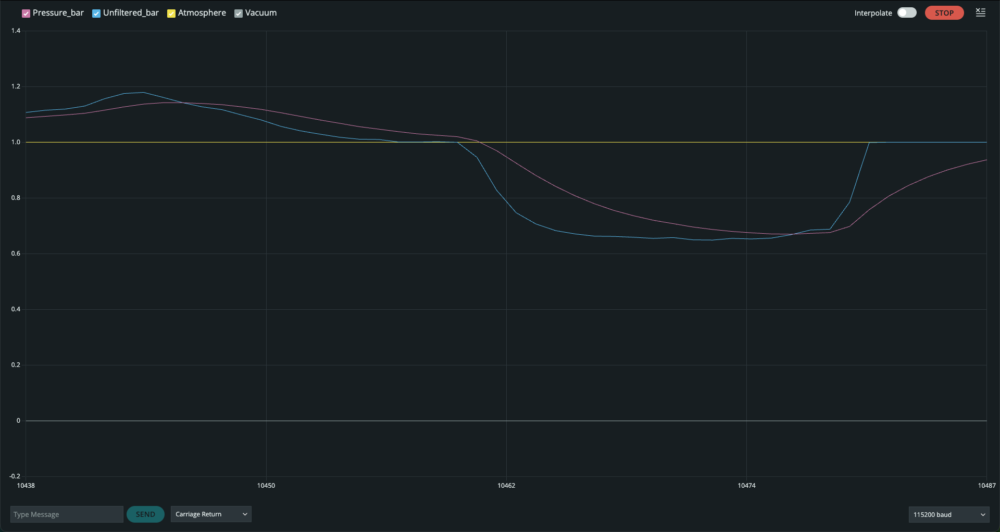
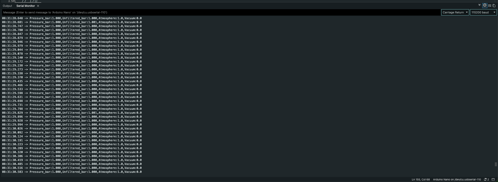

# Vacuum Jig Monitor

Proof-of-concept pressure monitor for a vacuum (suction) jig. An Arduino Nano
reads a XIDIBEI XDB401 pressure transducer and streams the jig pressure to the
Arduino IDE Serial Terminal and Serial Plotter, so a correctly seated, airtight part can be told
apart from a misplaced, leaking one.

Pressure is reported on an absolute-style scale: **atmosphere = 1.000 bar**,
**perfect vacuum = 0.000 bar**.

## Hardware

| Component | Notes |
|---|---|
| Arduino Nano (ATmega328P) | Classic Nano or compatible clone |
| XIDIBEI XDB401 pressure transducer | 5 VDC supply, 0.5–4.5 V output, 0–8 bar gauge |

### Wiring

| Sensor wire | Nano pin |
|---|---|
| +5 V (supply) | `5V` |
| GND | `GND` |
| OUT (signal) | `A6` |

The sensor and the ADC share the Nano's 5 V rail, so the measurement is
ratiometric and insensitive to USB supply variation. To improve reliability and stability in a noisy environment (installation on a
machine), add a 1 kΩ series resistor and a 100 nF capacitor to GND at `A6`.

## Building and uploading

1. Open `vacuum_jig_monitor/vacuum_jig_monitor.ino` in the Arduino IDE.
2. Select under **Tools**:

   | Setting | Value |
   |---|---|
   | Board | Arduino Nano |
   | Processor | **ATmega328P (Old Bootloader)** |
   | Port | The Nano's COM / tty port |

   Most Nano boards, including nearly all clones, use the old bootloader.
   With the wrong processor setting, the upload fails with
   `avrdude: stk500_getsync(): not in sync`. Boards with the newer Optiboot
   bootloader need **ATmega328P** instead.

3. Upload.

No external libraries are required.

## Usage

1. **Power up with the vacuum OFF.** The sketch captures the sensor output at
   atmospheric pressure as the 1.000 bar reference. If the reading is far from
   the nominal 0.5 V (for example, because the vacuum is on), the calibration
   is rejected and a warning is printed.
2. Open **Tools → Serial Plotter** (or Serial Monitor) at **115200 baud**.
3. Send `z` at any time, with the vacuum OFF, to re-capture the zero point.

### Serial output

One line every 50 ms (20 Hz), as comma-separated `label:value` pairs:

```
Pressure_bar:0.412,Unfiltered_bar:0.405,Atmosphere:1.0,Vacuum:0.0
```

| Trace | Description |
|---|---|
| `Pressure_bar` | Filtered pressure (exponential moving average) |
| `Unfiltered_bar` | Pressure from the 64× oversampled ADC reading |
| `Atmosphere` | Constant 1.0 bar reference line |
| `Vacuum` | Constant 0.0 bar reference line |

The reference lines keep the plotter's vertical axis stable. Status messages
start with `#` and contain no `:` or digits, so the plotter does not treat them
as data.

## Configuration

All tunable parameters are in the `Config` namespace at the top of the sketch.

| Parameter | Default | Description |
|---|---|---|
| `kSensorPin` | `A6` | Analog input connected to the sensor output |
| `kBaudRate` | `115200` | Serial baud rate |
| `kOversampleCount` | `64` | ADC samples averaged per reading |
| `kOutputPeriodMs` | `50` | Output period in ms (20 Hz) |
| `kFilterAlpha` | `0.2` | EMA smoothing factor; lower is smoother but slower |
| `kAutoZeroOnStartup` | `true` | Capture the atmospheric reference at power-up |
| `kMaxZeroDeviation` | `30` | Max allowed zero offset from nominal, in ADC counts (~0.3 bar) |
| `kSensorRangeBar` | `8.0` | Sensor full-scale range in bar |
| `kSaturationCounts` | `20` | ADC level below which the output is reported as saturated |

## Test results

First bench test of the proof of concept.

**Serial Plotter:** the pressure starts at atmosphere (1.0 bar), drops to
about 0.65 bar when suction is applied and returns to 1.0 bar when it is
released. The filtered trace (`Pressure_bar`) lags the unfiltered one
(`Unfiltered_bar`) because of the EMA filter.



**Serial Monitor:** steady 1.000 bar at atmosphere after the startup zero
calibration, with noise of about 1 mbar.



## Limitations

- The XDB401 used here is a **0–8 bar gauge** sensor. Pressures below
  atmosphere are outside its calibrated range. The output stays roughly linear
  for moderate vacuum but saturates near full vacuum; the sketch reports this
  with a status message.
- Accuracy is ±1 % FS (about ±80 mbar). Pass/fail thresholds should be set
  empirically from measurements of good and misplaced parts, which depends on
  repeatability rather than absolute accuracy.

## License

MIT, see [LICENSE](LICENSE).
